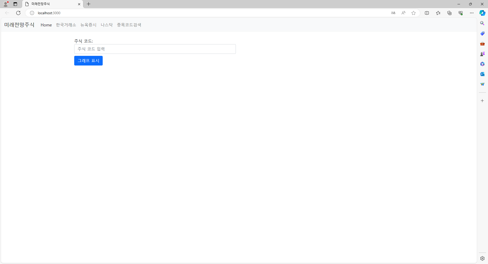

# LSTM을 이용한 한달 후까지 주식 값 예측하기💲💲💲

## 목차
  - [개요](#개요)
  - [프로젝트 설명](#프로젝트-설명)

## 개요
- 프로젝트 이름: LSTM 모델을 이용한 주식 예측 프로그램
- 프로젝트 제작 기간: 2024.03.08 ~ 현재 진행형
- 개발 언어: python, javascript, HTML, CSS
- 개발 엔진: vscode, node.js
- 팀 멤버: 길석종, 이창민

- ## 프로젝트 설명
|||
|:---:|:---:|
|메인 홈페이지|예측한 삼성주식|
****
실시간으로 변하는 주식의 값을 예측할 수 없지 않을 까 하는 생각에 이 프로젝트를 제작하게 되었습니다. 
### -어떻게 사용해?🤔 
메인 페이지에서 주식 코드((예)삼성의 주식코드 = 005930)를 입력하고 일정 시간이 지나면 그래프를 제공는데, 그래프의 포라색 부분이 앞으로 주식이 어떻게 될지 예상한 부분입니다. 
### -난 주식 코드를 잘 모르는걸😂 
인터넷에 검색하시는게 제일 정확하지만 그게 싫으시다면 저희가 개발한 종목코드검색 기능을 이용하세요. 회사의 이름을 입력하면 그 회사와 관련된 모든 주식코드를 제공해줄 겁니다. 

#주의 사항
이 프로젝트가 제공하는 결과가 무조건 옳다고 볼 순 없습니다. 참고용으로만 사용해 주세요.
